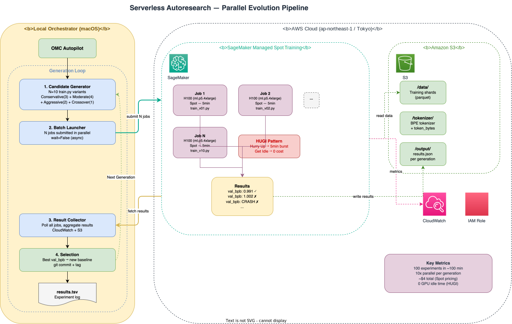

# Serverless Autoresearch

> Experimenting with cost-effective ways to run Karpathy's [autoresearch](https://github.com/karpathy/autoresearch) on AWS infrastructure, and documenting the journey as a hands-on tutorial.

## What is this?

This project explores how to run **autonomous AI-driven ML research** (autoresearch) on AWS as cost-effectively as possible. We experiment with different GPU instances, spot pricing strategies, and parallel execution patterns — then turn every experiment into a step-by-step tutorial that others can follow.

### Goals

1. **Cost optimization** — Find the most cost-effective GPU instance and pricing model for autoresearch on AWS (Spot, On-Demand, Capacity Blocks)
2. **Performance maximization** — Squeeze maximum val_bpb improvement from each dollar spent, using parallel evolution and cloud-native patterns
3. **Tutorial creation** — Document every experiment with reproducible steps, cost breakdowns, and lessons learned so anyone can replicate the results

### Approach

The original autoresearch runs experiments sequentially on a single GPU — 12 experiments/hour, ~8 hours for 100 experiments. We built a **parallel evolution pipeline** on SageMaker Managed Spot Training that leverages the **HUGI (Hurry Up and Get Idle)** pattern to complete **100 experiments in ~100 minutes at the same cost (~$4)** with zero GPU idle time.

## Architecture

<p align="center">
  
</p>

### Sequential vs Parallel

| | Original autoresearch | Serverless (this repo) |
|---|---|---|
| **Execution** | 1 experiment at a time | **10 experiments in parallel** |
| **100 experiments** | ~8 hours | **~100 minutes** |
| **Cost** | ~$4 (GPU always on) | **~$4** (HUGI: pay only when running) |
| **GPU** | 1x H100 (always occupied) | N x H100 Spot (on-demand burst) |
| **Search strategy** | Greedy (sequential) | **Population-based evolution** |
| **Improvement probability** | 18% per experiment | **86% per generation** |

### HUGI Pattern (Hurry Up and Get Idle)

```
Traditional GPU server:
  ████░░░░████░░░░████░░░░████░░░░  (utilization ~50%, paying 24/7)

HUGI with SageMaker Spot:
  ██████████                          (utilization 100%, $0 when idle)
  ↑ N GPUs burst                 ↑ terminate immediately
```

## Quick Start

### Prerequisites

- AWS CLI configured (`aws configure`)
- Python 3.11+
- [SageMaker Python SDK](https://sagemaker.readthedocs.io/)

```bash
pip install boto3 sagemaker pyyaml click
```

### 1. Setup IAM Role

```bash
./infrastructure/setup_iam.sh --profile personal --region ap-northeast-1
# → Copy role ARN to config.yaml
```

### 2. Prepare Data (one-time, ~5 min)

```bash
make prepare
```

Downloads 10 training shards + validation shard from HuggingFace, trains BPE tokenizer, uploads everything to S3.

### 3. Verify Setup

```bash
make dry-run
```

### 4. Run Experiments

```bash
# Single experiment test (~$0.04, ~10 min)
make run-single

# Full pipeline (~$4, ~100 min)
make run
```

## How It Works

### Generation Loop

Each generation follows 4 steps:

1. **Candidate Generation** — Creates N variants of `train.py` with diverse strategies:

   | Strategy | Count | Description |
   |----------|-------|-------------|
   | Conservative | 3 | LR adjustments (±10-30%) |
   | Moderate | 4 | Architecture changes (depth, width, window, batch) |
   | Aggressive | 2 | Radical combinations (deep-narrow, wide-shallow) |
   | Crossover | 1 | Combine ideas from top-2 of previous generation |

2. **Batch Launch** — Submits all N candidates as parallel SageMaker Spot Training Jobs (async, `wait=False`)

3. **Result Collection** — Polls all jobs until completion, extracts `val_bpb` metric from CloudWatch

4. **Selection** — Best `val_bpb` becomes new baseline, committed with git tag `gen-NNN-best`

### The Rules (same as original autoresearch)

- Only `train.py` can be modified (model architecture, optimizer, hyperparameters)
- `prepare.py` is read-only (evaluation function, data loading, constants)
- No new dependencies allowed
- Fixed 5-minute training time budget (TIME_BUDGET=300s)
- Goal: **lowest val_bpb** (validation bits per byte)

## Project Structure

```
serverless-autoresearch/
├── train.py                    # Training script (agent modifies this)
├── prepare.py                  # Data prep + evaluation (read-only)
├── config.yaml                 # AWS & pipeline config (gitignored)
├── config.yaml.example         # Config template
├── program.md                  # Agent instructions
├── Makefile                    # make run, make dry-run, make cost, etc.
│
├── src/                        # Source code (cookiecutter-style)
│   ├── pipeline/               # Core evolution pipeline
│   │   ├── orchestrator.py     # Main evolution loop
│   │   ├── candidate_generator.py
│   │   ├── batch_launcher.py
│   │   ├── result_collector.py
│   │   └── selection.py
│   ├── sagemaker/              # SageMaker wrappers
│   │   ├── entry_point.py
│   │   └── train_wrapper.py
│   └── scripts/                # CLI utilities
│       ├── prepare_s3.py
│       ├── run_single.py
│       └── cost_report.py
│
├── data/raw/                   # Data references (actual data in S3)
├── models/                     # Trained model artifacts
├── notebooks/                  # Jupyter notebooks (analysis)
├── references/                 # Research notes & external references
├── experiments/                # Per-experiment reports & results
│   ├── 001-baseline-l40s/
│   └── 002-optimization-l40s/
├── docs/                       # Project documentation & diagrams
├── infrastructure/             # AWS IAM, Dockerfile, requirements
└── generations/                # Pipeline output (per-generation)
```

## Configuration

`config.yaml`:

```yaml
aws:
  profile: personal
  region: ap-northeast-1          # Tokyo (H100 Spot available)
  role_arn: "arn:aws:iam::..."

sagemaker:
  instance_type: ml.p5.4xlarge    # H100 80GB
  use_spot: true
  max_run: 900                    # 15 min
  max_wait: 3600                  # 1 hour spot wait
  framework_version: "2.8.0"
  py_version: "py312"

pipeline:
  num_generations: 10
  population_size: 10
  num_conservative: 3
  num_moderate: 4
  num_aggressive: 2
  num_crossover: 1
```

## Cost

| Component | Unit Cost | Qty | Total |
|-----------|-----------|-----|-------|
| ml.p5.4xlarge Spot (8min/exp) | ~$0.04 | 100 | ~$4.00 |
| S3 storage | — | — | ~$0.10 |
| **Total** | | | **~$4.10** |

## OMC Autopilot Integration

Run the full pipeline autonomously with [oh-my-claudecode](https://github.com/nicobailon/oh-my-claudecode):

```
/autopilot

Read program.md and execute:
python -m pipeline.orchestrator --generations 10 --population 10

After completion, analyze results.tsv and summarize findings.
```

## Experiments & Tutorials

| # | Experiment | GPU | val_bpb | Cost | Key Finding |
|---|-----------|-----|---------|------|-------------|
| [001](experiments/001-baseline-l40s/report.md) | Baseline on L40S | ml.g7e.4xlarge | 1.065 | $0.04 | Pipeline validated, SDPA fallback works |
| 002 | L40S Optimization | ml.g7e.4xlarge | _TBD_ | _TBD_ | [Research notes](references/l40s-optimization-strategies.md) |
| 003 | H100 Fair Comparison | ml.p5.4xlarge | _TBD_ | _TBD_ | Pending quota approval |

## Documentation

| Document | Description |
|----------|-------------|
| [Comparison Report](docs/comparison-report.md) | Original sequential vs serverless parallel pipeline — architecture, cost, search efficiency |
| [GPU Cost Analysis](docs/gpu-cost-analysis.md) | P5 (H100) vs P6 (B200/B300) pricing and performance for autoresearch workloads |
| [Architecture Diagram](docs/architecture.svg) | System architecture (SageMaker + S3 + local orchestrator) |
| [Sequential vs Parallel](docs/comparison-diagrams.svg) | Visual comparison of sequential and parallel experiment pipelines |

## Credits

- [karpathy/autoresearch](https://github.com/karpathy/autoresearch) — Original sequential autoresearch framework
- [karpathy/nanochat](https://github.com/karpathy/nanochat) — Training codebase that autoresearch is based on

## License

MIT
