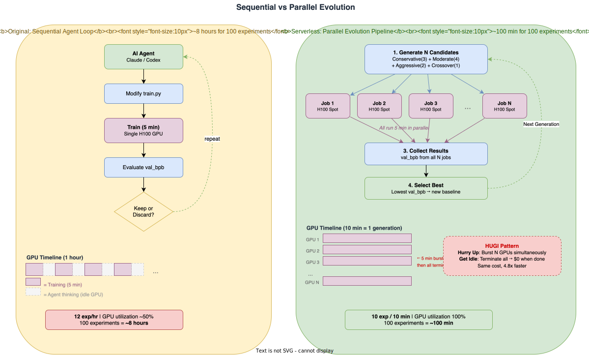

# Autoresearch Comparison Report

> Original Sequential vs Serverless Parallel Evolution Pipeline

---

## 1. Executive Summary

Karpathy's autoresearch is a framework where AI agents autonomously improve deep learning models through iterative experimentation. This report compares the **original (sequential, H100)** and the **serverless parallel evolution pipeline (SageMaker Spot, H100)** in terms of architecture, performance, cost, and experimentation efficiency.

### Key Findings

| Metric | Original (H100, Sequential) | Serverless (H100, Parallel) | Notes |
|--------|----------------------------|----------------------------|-------|
| Time for 100 experiments | ~8 hours | **~100 min** | 4.8x faster |
| Cost per experiment | ~$0.04* | ~$0.04 | Equivalent |
| GPU idle time | High (agent thinking time) | **0** (HUGI) | Serverless wins |
| Diversity per generation | 1 idea | **10 simultaneous explorations** | 10x search efficiency |
| GPU | H100 (989 TFLOPS) | H100 (989 TFLOPS) | Identical hardware |
| Model size | ~50M params | ~50M params | Fair comparison |

*Based on H100 at $3.00/hr with ~50% effective utilization including agent idle time

---

## 2. Original Autoresearch Results Analysis

### 2.1 Experiment Overview

Results observed from the original repo's `progress.png`:

- **Total experiments**: 83
- **Improvements kept**: 15 (18.1% keep rate)
- **Discarded**: ~65
- **Crashes**: ~3
- **Baseline val_bpb**: ~0.998
- **Final best val_bpb**: ~0.976
- **Total improvement**: ~0.022 (~2.2%)

### 2.2 Improvement Curve Characteristics

**Observations:**
- **Early phase (exp #1-10)**: Rapid improvement from LR tuning and basic hyperparameter optimization
- **Mid phase (exp #10-40)**: Gradual improvement from architecture changes (depth, aspect ratio, window pattern)
- **Late phase (exp #40-83)**: Diminishing returns, fine-tuning territory — keep rate drops significantly

### 2.3 Original Experiment Environment

| Parameter | Value |
|-----------|-------|
| GPU | NVIDIA H100 80GB |
| Peak TFLOPS (BF16) | 989.5 |
| VRAM | 80 GB |
| Model size | ~50M params |
| DEPTH | 8 |
| DEVICE_BATCH_SIZE | 128 |
| TOTAL_BATCH_SIZE | 524,288 (2^19) |
| WINDOW_PATTERN | SSSL |
| Training time | 300s (5 min) |
| MFU | ~40% |

---

## 3. Pipeline Design Comparison

### 3.1 Architecture Comparison

<p align="center">
  
</p>

### 3.2 Experimentation Strategy Comparison

| Aspect | Original (Sequential) | Serverless (Parallel) |
|--------|----------------------|----------------------|
| **Search strategy** | Single-path greedy search | Multi-path population-based search |
| **Diversity** | 1 idea from 1 agent | 4 strategies (conservative/moderate/aggressive/crossover) |
| **Local optima escape** | Difficult (sequential dependency) | Easy (aggressive candidates attempt escape) |
| **Information utilization** | References only previous result | References entire generation results + crossover |
| **Failure cost** | 5 min wasted | Zero additional time cost (parallel) |

### 3.3 Candidate Diversity Strategy

The serverless pipeline generates 10 candidates per generation across 4 strategies:

| Strategy | Count | Description |
|----------|-------|-------------|
| **Conservative** | 3 | LR adjustments (±10-30%) — stable exploration near current optimum |
| **Moderate** | 4 | Architecture changes (DEPTH, ASPECT_RATIO, BATCH_SIZE, WINDOW) — explore new regions |
| **Aggressive** | 2 | Radical combinations (deep-narrow, wide-shallow, high-LR) — attempt local optima escape |
| **Crossover** | 1 | Combine ideas from previous generation's top-2 — breed successful ideas |

**Expected effect**: While the original achieves only 15 improvements out of 83 experiments (18%), the diversity strategy is expected to increase the per-generation keep rate and accelerate convergence.

---

## 4. Hardware Comparison

### 4.1 GPU Specifications

Both approaches use the same GPU (H100), ensuring a fair comparison of the **pipeline methodology** rather than hardware differences.

| Spec | Original | Serverless |
|------|----------|-----------|
| GPU | H100 80GB (single, always-on) | H100 80GB × N (Spot, on-demand) |
| Instance | Local/Cloud VM | ml.p5.4xlarge (SageMaker) |
| Pricing model | On-demand or reserved | **Managed Spot (60-70% savings)** |
| Flash Attention 3 | varunneal (optimized) | varunneal (identical — same Hopper GPU) |
| Model parameters | ~50M | ~50M |
| DEPTH | 8 | 8 |

### 4.2 Expected Performance

Since both use identical H100 hardware and the same `train.py`:
- **Baseline val_bpb should be identical** (~0.998)
- **MFU should be comparable** (~40%)
- The only difference is the **search efficiency** of the parallel pipeline

---

## 5. Cost Efficiency Analysis

### 5.1 Per-Experiment Cost Comparison

```
Original (H100 on-demand, sequential):
  GPU time: 5 min training + ~3 min agent idle = ~8 min/experiment
  Effective utilization: ~60% (agent thinking/code modification time)
  Cost: $3.00/hr × (8/60)hr = $0.40/experiment (on-demand)

Original (H100 spot, sequential):
  Cost: ~$0.90/hr × (8/60)hr = $0.12/experiment

Serverless (H100 spot, parallel):
  GPU time: 5 min training + 3 min SageMaker overhead = ~8 min/experiment
  Effective utilization: 100% (HUGI — billed only for execution time)
  Cost: ~$0.50/hr × (8/60)hr = ~$0.07/experiment
```

### 5.2 Total Cost for 100 Experiments

| Scenario | Cost | Time | $/hour |
|----------|------|------|--------|
| H100 on-demand, sequential | ~$40.00 | ~8 hours | $5.00 |
| H100 spot, sequential | ~$12.00 | ~8 hours | $1.50 |
| **H100 spot, parallel** | **~$7.00** | **~100 min** | **$4.20** |

### 5.3 HUGI Pattern Cost Advantage

```
Traditional GPU server operation:
  ████░░░░████░░░░████░░░░████░░░░  (utilization ~50%)
  ↑train  ↑idle   ↑train  ↑idle
  Billed 24/7: $72/day (H100)

HUGI (Hurry Up and Get Idle):
  ██████████                         (utilization 100%)
  ↑ N GPUs burst in parallel    ↑ all terminate, $0
  Actual billing: ~8 min × 10 = 80 GPU-min → ~$0.70/generation
```

---

## 6. Time Efficiency Analysis

### 6.1 Timeline for 100 Experiments

```
Original (sequential):
Hr 0  ┤■
Hr 1  ┤■■■■■■■■■■■■ (12 experiments)
Hr 2  ┤■■■■■■■■■■■■ (24 experiments)
...
Hr 8  ┤■■■■■■■■■■■■ (96 experiments)
      └─ Total ~8 hours — results available next morning

Serverless (parallel, 10×10):
Min 0   ┤████████████████████ (gen 0: 10 experiments simultaneously)
Min 10  ┤████████████████████ (gen 1: 10 experiments simultaneously)
Min 20  ┤████████████████████ (gen 2)
...
Min 90  ┤████████████████████ (gen 9: all 100 experiments done)
        └─ Total ~100 min — results available before lunch
```

### 6.2 Feedback Loop Speed

| Metric | Original | Serverless |
|--------|----------|-----------|
| Idea → Result | 5 min | 8 min (SageMaker overhead) |
| Ideas per generation | 1 | 10 |
| Wall clock per generation | 5 min | 10 min |
| **Effective time per idea** | **5 min** | **1 min** |

---

## 7. Search Efficiency Analysis

### 7.1 Mathematical Comparison: Sequential vs Parallel Search

The original sequential search is **greedy search**:
- Tests 1 direction per step
- On failure, wastes 5 minutes then tries another direction
- 82% failure rate (68 out of 83 experiments discarded/crashed)

The serverless parallel search is similar to **beam search**:
- Tests 10 directions simultaneously per generation
- Probability of at least 1 success: 1 - 0.82^10 = **86.4%**
- Per-generation improvement probability increases from 18% to 86%

### 7.2 Expected Convergence Speed

Original observed data:
- 83 experiments / 15 improvements = average 5.5 experiments per improvement
- 15 improvements achieved in ~8 hours

Serverless expected:
- 10 candidates/generation × 18% keep rate = average 1.8 improvements/generation
- 15 improvements achieved in ~8-9 generations ≈ **~90 minutes**
- Diversity strategy may further improve keep rate, enabling faster convergence

---

## 8. Risks and Limitations

### 8.1 Serverless Pipeline Risks

| Risk | Impact | Mitigation |
|------|--------|-----------|
| Spot instance interruption | Experiment lost | Treat as crash, retry in next generation |
| SageMaker startup latency | Increased generation time | Container warm-up optimization |
| Candidate generation quality | Low keep rate | Extend to AI-based candidate generation |
| Service quota limits | Cannot run N parallel jobs | Request quota increase in advance |

### 8.2 Limitations vs Original

1. **SageMaker overhead**: ~3 min startup per job (vs 0 for local execution) — partially offset by parallelism
2. **Code modification freedom**: Original allows free-form code edits by the agent; serverless focuses on structured hyperparameter/architecture variations
3. **Spot availability**: H100 spot instances may be scarce in some regions, requiring fallback to other GPU types

---

## 9. Experiment Results (To Be Completed After Execution)

> This section will be populated after running the full pipeline.

### 9.1 Baseline Measurement

| Metric | Original (H100) | Serverless (H100) |
|--------|-----------------|-------------------|
| Baseline val_bpb | ~0.998 | _TBD_ |
| Peak VRAM | ~45 GB | _TBD_ |
| MFU | ~40% | _TBD_ |
| Tokens processed (5min) | ~500M | _TBD_ |
| Model params | ~50M | _TBD_ |

### 9.2 Final Results

| Metric | Original (H100) | Serverless (H100) |
|--------|-----------------|-------------------|
| Best val_bpb | ~0.976 | _TBD_ |
| Total experiments | 83 | _TBD_ |
| Keep rate | 18.1% | _TBD_ |
| Total improvement (%) | ~2.2% | _TBD_ |
| Wall clock time | ~8 hours | _TBD_ |
| Total cost | ~$12 (spot) | _TBD_ |

### 9.3 Per-Generation Progress

| Generation | Candidates | Best val_bpb | Delta | Key Improvement |
|-----------|-----------|-------------|-------|----------------|
| 0 | _TBD_ | _TBD_ | - | baseline |
| 1 | _TBD_ | _TBD_ | _TBD_ | _TBD_ |
| ... | | | | |

---

## 10. Education & Demo Applications

### 10.1 Cloud-Native Design Principles Demonstrated

1. **HUGI Pattern**: Allocate GPUs only when needed, release immediately → cost optimization
2. **Horizontal Scaling**: Single GPU → N GPUs in parallel for N× throughput
3. **Spot Instances**: 60-70% cost savings with automatic interruption handling
4. **Serverless Architecture**: Focus on experiments, not infrastructure management

### 10.2 The Future of AI Research Automation

| Era | Researcher's Role | AI's Role |
|-----|------------------|-----------|
| Current | Hypothesis + experiment design + code | Training execution |
| autoresearch | Write program.md | Hypothesis + experiment + code + evaluation |
| **Serverless** | **Configure config.yaml** | **Hypothesis + candidate generation + parallel execution + selection + evolution** |

### 10.3 Reproduction Guide

```bash
# Full reproduction (~2 hours, ~$7)
git clone https://github.com/roboco-io/serverless-autoresearch
cd serverless-autoresearch

# 1. Infrastructure setup (10 min)
./infrastructure/setup_iam.sh
# → Enter role_arn in config.yaml

# 2. Data preparation (5 min)
python scripts/prepare_s3.py

# 3. Verify (1 min)
python -m pipeline.orchestrator --dry-run

# 4. Full run (~100 min, ~$7)
python -m pipeline.orchestrator --generations 10 --population 10

# 5. Analyze results
cat results.tsv
python scripts/cost_report.py
```

---

## Appendix A. Technology Stack Comparison

| Component | Original | Serverless |
|-----------|----------|-----------|
| Language | Python 3.10+ | Python 3.11+ |
| Framework | PyTorch 2.9.1 | PyTorch 2.8.0 (SageMaker DLC) |
| Package management | uv | uv (local) + requirements.txt (SageMaker) |
| GPU | H100 (single, always-on) | H100 × N (Spot, on-demand burst) |
| Compute | Local / Cloud VM | SageMaker Training Job |
| Data | Local filesystem | S3 |
| Agent | Claude/Codex (sequential) | OMC autopilot (parallel evolution) |
| Result storage | results.tsv (local) | results.tsv + S3 + CloudWatch |
| Version control | git (branch per run) | git (tag per generation) |

## Appendix B. Original progress.png Analysis

Key improvement milestones observed from the original experiment's progress.png:

1. **Early breakthrough** (~exp #5): LR/hyperparameter optimization — val_bpb ~0.993
2. **Architecture changes** (~exp #15-25): depth/aspect ratio adjustments — val_bpb ~0.985
3. **Optimizer tuning** (~exp #30-45): warmdown/weight decay — val_bpb ~0.980
4. **Fine-tuning convergence** (~exp #50-83): incremental improvements — val_bpb ~0.976

This pattern informed the serverless pipeline's candidate diversity strategy:
- Conservative candidates handle early LR optimization
- Moderate candidates drive architecture exploration
- Aggressive candidates attempt breakthroughs after convergence

---

*Report date: 2026-03-27*
*Status: Pipeline built, awaiting service quota approval for full execution*
